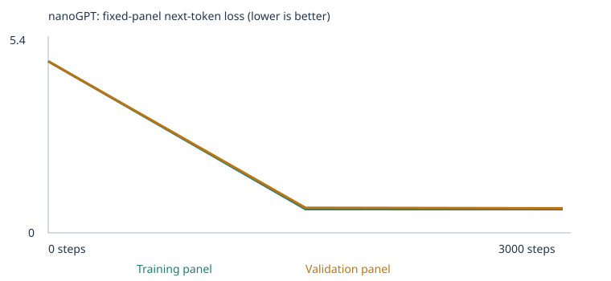

# Formal starter experiment

Classroom corpus; fresh model; 3,000 updates; learning rate 0.0015; seed 42.

[Executed notebook](starter_3000steps.ipynb)

Run: `llm_runs/20260922T000429_567209Z`. Training loop reported 9.285 seconds on CPU (not full environment setup or notebook wall time). 111,872 parameters; vocabulary 136 tokens; 4,132 training and 460 validation passages; both corpus unknown-token rates 0%. No imported corpus files.

## Loss

Fixed panels of 20 training and 20 validation documents; not full-corpus loss.

|Step|Training loss|Validation loss|
|---|---|---|
|0|4.926252841949463|4.927548408508301|
|1500|0.6793705224990845|0.7186149954795837|
|3000|0.6775152683258057|0.7051523923873901|



## Evaluation

|Stage|Correct / all|Scorable accuracy|Coverage|
|---|---|---|
|Untrained|9/48 (18.75%)|9/24 (37.5%)|24/48 (50%)|
|Trained|21/48 (43.75%)|21/24 (87.5%)|24/48 (50%)|

Starter patterns improved from 6/16 to 16/16; new wording improved from 3/8 to 5/8. All 24 extension cases remain unscorable due to missing vocabulary. Scores measure four-choice next-word ranking, not free continuation correctness. Public development benchmark, not unseen generalization evidence.

- [untrained full results](llm_runs/20260922T000429_567209Z/language_evals/untrained/eval_results.json) · [CSV](llm_runs/20260922T000429_567209Z/language_evals/untrained/eval_results.csv) · [category summary](llm_runs/20260922T000429_567209Z/language_evals/untrained/eval_summary.json)
- [final full results](llm_runs/20260922T000429_567209Z/language_evals/final/eval_results.json) · [CSV](llm_runs/20260922T000429_567209Z/language_evals/final/eval_results.csv) · [category summary](llm_runs/20260922T000429_567209Z/language_evals/final/eval_summary.json)

[Separation checks](llm_runs/20260922T000429_567209Z/eval_separation.json): 160 classroom passages excluded by reserved-prefix filtering. Test file hash is unchanged. These checks do not detect all semantic leakage.

## Complete saved sample timeline

### [step_0000](llm_runs/20260922T000429_567209Z/samples/step_0000.txt)

```text
pear professor bond doctor course harvest team physician journey checking buyer delivery traffic report the lecturer item offering and system <UNK> taste recommended mentioned bus question customer at mortgage nurse in instructor
kitchen purchase journey product question discussion journey service . nurse local
compared and purchase update mortgage question loan taste in market treatment learned another item bicycle product bicycle focused data and dentist recommended mango apple taxi bicycle delivery peach quality update student lesson
important hospital juice patient return recommended deposit tutor returned understand kitchen student design ordered hospital treatment important package traffic with yesterday investment important of mentioned store ordered mortgage nurse shopper the station
```

### [step_1500](llm_runs/20260922T000429_567209Z/samples/step_1500.txt)

```text
our school has a question about the new educator and lesson .
a review of risk helped us understand the different deposit .
we learned about the important website during a discussion of data .
our school has a question about the different instructor and course .
```

### [step_3000](llm_runs/20260922T000429_567209Z/samples/step_3000.txt)

```text
our school has a question about the new educator and lesson .
a review of risk helped us understand the different deposit .
the report about the nurse explains the health in detail .
the consumer compared the offering after checking the price .
```

Outputs become recognizable classroom sentence templates, but this does not demonstrate general conversation or novel-template understanding.

## Inspection evidence

Token `customer` has ID 28; its embedding contains 64 learned numbers. First coordinate over full training: -0.057591915130615234 → 0.02767994813621044. The ID is a lookup index, not a semantic quantity.

First update: {"token": "customer", "coordinate": 0, "before": -0.057591915130615234, "gradient": 0.0006925869965925813, "learning_rate": 1.5e-05, "after": -0.05760690197348595}. Warmup makes the first actual learning rate 0.000015. AdamW uses gradient history, adaptive scaling and weight decay, so the update is not simply learning rate times gradient.

After prefix `the customer`, probability for `reviewed` changes from 0.711145% to 17.718221%. Sampling remains probabilistic.

- [tokenization.json](llm_runs/20260922T000429_567209Z/tokenization.json)
- [inspection.json](llm_runs/20260922T000429_567209Z/inspection.json)
- [config.json](llm_runs/20260922T000429_567209Z/config.json)
- [training.csv](llm_runs/20260922T000429_567209Z/training.csv)
- [training_summary.json](llm_runs/20260922T000429_567209Z/training_summary.json)
- [temperature_comparison.json](llm_runs/20260922T000429_567209Z/temperature_comparison.json)
- [corpus_manifest.json](llm_runs/20260922T000429_567209Z/corpus_manifest.json)
- [vocabulary_report.json](llm_runs/20260922T000429_567209Z/vocabulary_report.json)
- [chat_transcript.json](llm_runs/20260922T000429_567209Z/chat_transcript.json)

Training changes network weights. Temperature changes inference sampling without changing weights. The setup-to-formal comparison changes the update budget and its dependent warmup/cosine schedule; it is not a comparison of different base learning rates.

Remaining assignment work: learner explanations, two-category corpus extension and second experiment, at least three actual chat turns plus visual evidence, and final README/public repository.
